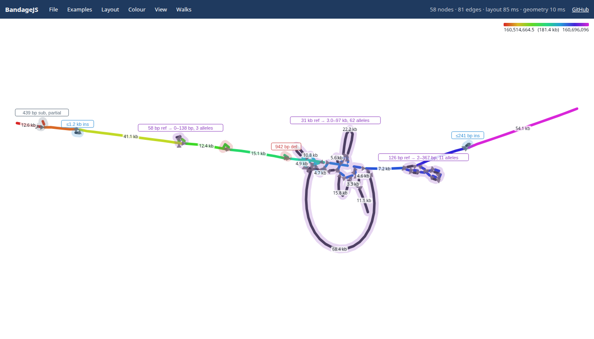

# BandageJS

View GFA graphs in the browser: https://jbrowse.org/demos/bandagejs/

- Bandage's FMMM layout, compiled to wasm and run in a worker
- Anchored, ordered, sample-row, walk-row and variant-map layouts for graphs
  with reference coordinates
- Bubbles labelled by kind, and haplotype walks you can lift out of the drawing
- Open a file, paste a url, drop a GFA, or use `?gfa=<url>`
- Cut a region live from a gbz-base database, such as HPRC's:
  `?gbz=hprc&loc=chr6:160,614,798-160,647,758&haps=HG00097,HG00133`

Built on the core of
[jbrowse-plugin-graphgenomeviewer](https://github.com/GMOD/jbrowse-plugin-graphgenomeviewer),
included as a submodule. See [docs/developing.md](docs/developing.md).

The earlier BandageNG fork is on the
[`bandage-layout-js`](https://github.com/cmdcolin/BandageJS/tree/bandage-layout-js)
branch.

GPL-3.0-or-later.
