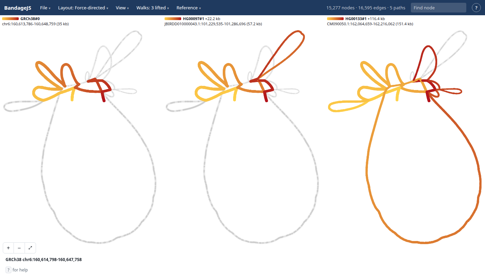
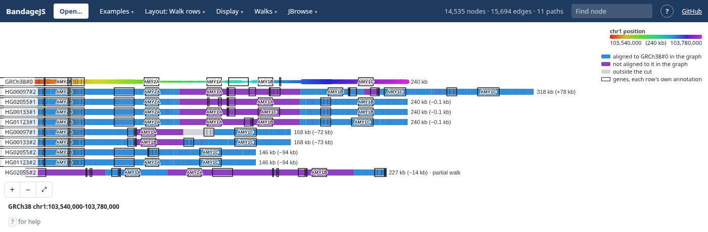
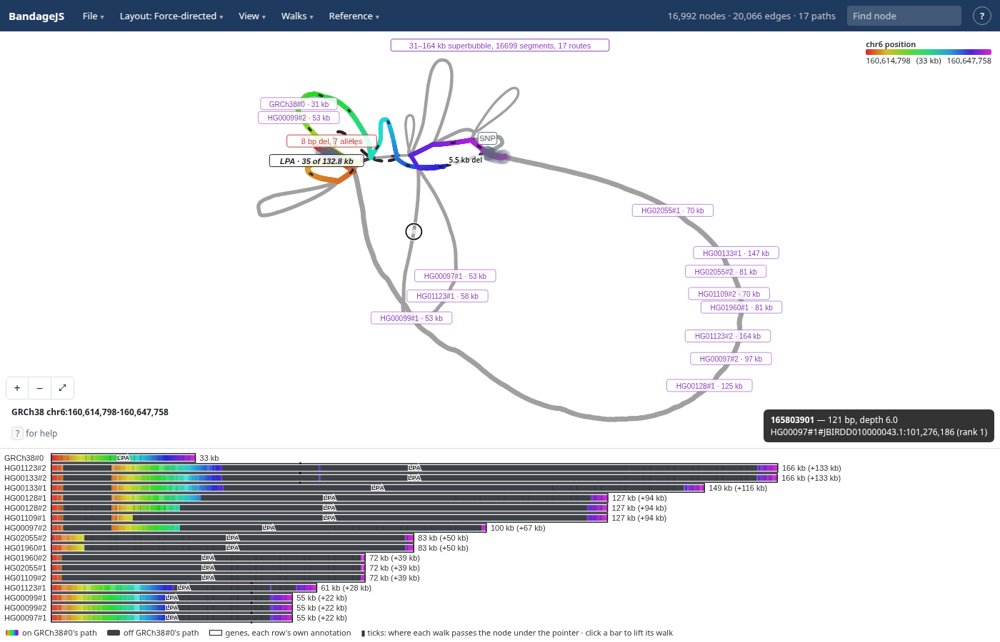

# BandageJS

View GFA graphs in the browser: https://jbrowse.org/demos/bandagejs/


- Bandage's FMMM layout, compiled to wasm and run in a worker, with its quality,
  spacing and component separation under Layout → Layout settings…, where Engine
  switches to an experimental stress layout in plain JS: distances along the
  graph become distances on the page, so the reference reads straight and a
  repeat loop reads as a ring
- Anchored, ordered, sample-row and walk-row layouts for graphs with reference
  coordinates, and sequenceTubeMap's tube map for graphs with paths
- Bubbles labelled by kind, and haplotypes highlighted in the drawing: several
  at once as lanes, or side by side, one panel per walk
- Haplotype bars under any layout that draws nodes (Haplotypes → Bars under the
  graph): pointing at a bar rings its node in the drawing, and the node under
  the pointer ticks every walk that passes it
- Genes along the reference nodes, their exons outlined in gold, read from the
  gene track of the assembly the reference is on, found in JBrowse configs: the
  HPRC portal's hg38 and haplotypes, UCSC's CHM13, or any genome on
  genomes.jbrowse.org. A site sets its own in `config.json`. File → Open genes…
  shows your own GFF3 or BED. Pointing at a reference node names the genes over
  it. See [docs/genes.md](docs/genes.md)
- Click a node, or find it by name, for its details beside the drawing: where it
  lies, the nodes at each end (a click steps to one), the walks through it with
  where each passes it, its bubble and its genes
- Go to a region or gene on the reference from the location box (`g`): type
  `chr6:160,614,798-160,647,758`, one position, or a gene's name, and ‹ › step
  half a window along the reference
- Open a file, paste a url, drop a GFA (plain or gzipped), or use `?gfa=<url>`
- The Open dialog lists recent files, urls and cuts to reopen in a click
- Cut a region live from a gbz-base database, such as HPRC's:
  `?gbz=hprc&loc=chr6:160,614,798-160,647,758&haps=HG00097,HG00133`. Paste any
  `.gbz.db` url to cut from your own; the location box then moves the window,
  cutting afresh outside it
- The address keeps everything on screen, so File → **Copy link** shares the
  view as it is; see [Links](#links)

## Haplotypes

The Haplotypes menu highlights walks in the drawing, and the rest of the graph
fades to grey. A walk highlighted alone shades light to dark along itself; its
key is a short bar of that gradient with its stretch on its own contig written
under it. Walks highlighted together are **Overlaid**, each in one flat colour,
a lane apiece. **Side by side** draws the same layout once per walk instead,
every panel on one shared gradient, yellow where its walk starts and red where
it ends, a panel per walk. **Grid by sample** gives each sample a row and each
haplotype a column, so a sample's two haplotypes read across one row. The panels
share one view, so a pan, zoom, drag or hover in one moves or marks them all. As
many go across as draws each panel largest, and `columns=` in a link fixes the
count. A panel's title is its walk's key; clicking it highlights that walk
alone. **Colour highlighted…** picks what each highlighted walk's lane shows and
in which palette.

Through the LPA KIV-2 array HG00097 carries 22 kb more than GRCh38 and HG00133
116 kb more:



A link states the walks and the facet, which the page keeps in its address as
they change:
`?gbz=hprc&loc=chr6:160,614,798-160,647,758&haps=HG00097,HG00133&walk=GRCh38%230%23chr6&walk=HG00133%231%23CM090050.1&facet=walk&columns=2`

## Links

The page rewrites its address as the view changes, so the address is always a
link to what is on screen, and File → **Copy link** copies it. A graph opened
from this computer has no address to link to. The parameters:

| Parameter                                              | What it states                                                                                                                               |
| ------------------------------------------------------ | -------------------------------------------------------------------------------------------------------------------------------------------- |
| `gfa`                                                  | The GFA's url                                                                                                                                |
| `gbz`, `index`, `loc`, `ref`, `haps`                   | A gbz-base cut: the `.gbz.db` url or `hprc`, its haplotype index, the region, the reference sample, and the haplotypes kept, comma separated |
| `hub`, `assembly`, `contigs`                           | JBrowse configs to read genes from, the assembly the reference is on, and `graph:assembly` contig names where they differ                    |
| `along`                                                | The walk a walk-anchored graph draws x along                                                                                                 |
| `walk`                                                 | A highlighted walk, once per walk                                                                                                            |
| `node`                                                 | The selected node                                                                                                                            |
| `view`                                                 | The layout point at the pane's centre and the zoom, `x,y,scale`; absent while the graph is fitted to the window                              |
| `layout`                                               | `force`, `anchored`, `ordered`, `samplerows`, `walkrows`, `tubemap` or `tubemapref`                                                          |
| `color`, `width`, `thickness`                          | The colour scheme, whether depth widens nodes (`depth` or `uniform`), and a node's width in px                                               |
| `bubbles`, `deletions`, `genes`, `paths`, `bars`       | What is drawn, `1` or `0`: bubble labels, deletion edges, genes, every haplotype in colour, and haplotype bars under the graph               |
| `facet`, `columns`                                     | How highlighted walks are drawn, `none`, `walk` or `sample`, and how many panels go across                                                   |
| `engine`, `quality`, `spacing`, `separation`, `spread` | The force layout's engine, quality, spacing, component separation and bubble spread, as Layout settings… offers them                         |

Settings appear only where they differ from the defaults, the layout aside, so a
changed default reaches a link's reader. A link's settings hold for the visit.

## Figures

File → **Export SVG** saves the drawing, its walks' keys and panels, and the
walk rows under it, as a vector figure. **Copy figure spec** copies the JSON
spec for what is on screen, which `bandage-figure` in
[@jbrowse/bandage-core](https://www.npmjs.com/package/@jbrowse/bandage-core)
turns into the same figure with no browser, so a figure in a paper can be made
again from its spec:

```console
npx -p @jbrowse/bandage-core bandage-figure spec.json -o figure.svg
```

Every SVG carries its spec in its metadata. The export draws walk rows under the
graph at most 260 px tall, as `bandage-figure` does, while the screen also caps
them at 40% of the window. On a short window the export can therefore box genes
the screen leaves out.
[docs/figures.md](https://github.com/GMOD/jbrowse-plugin-graphgenomeviewer/blob/main/docs/figures.md)
describes the spec.

## More graphs

A de novo assembly graph, coloured at random per contig as Bandage does:


The amylase locus cut from the HPRC graph for four samples, as walk rows. Each
bar is one haplotype's assembly through the locus, boxed with the genes HPRC's
CAT annotation gives that assembly, under CAT's names. The boxes count the AMY1
copies: one at 146 kb, two at 168 kb, three at 240 kb as in GRCh38, four at 318
kb. Length can't tell the copies apart: HG01123#2 and HG02055#2 both run 146 kb
with one AMY1, but only HG01123#2 has AMY2A, where HG02055#2 has the AMYP1
pseudogene; the boxes say which gene each copy is. A stretch on GRCh38's path
takes the hue of the GRCh38 stretch it runs through; charcoal is off GRCh38's
path, an alternative route through the graph and not sequence GRCh38 lacks:



LPA KIV-2 in eight HPRC samples, force-directed with the walk rows under it. The
pointer on HG01123#2's bar rings that node in the hairball above, and the ticks
mark where each other walk passes the same node. Each bar is boxed in LPA from
its own assembly's annotation; a strip with too many rows to box genes in leaves
them out and says so:



Five E. coli strains through a pggb graph, as a tube map:


Built on
[@jbrowse/bandage-core](https://www.npmjs.com/package/@jbrowse/bandage-core),
the core of
[jbrowse-plugin-graphgenomeviewer](https://github.com/GMOD/jbrowse-plugin-graphgenomeviewer).
See [docs/developing.md](docs/developing.md).

The earlier BandageNG fork is on the
[`bandage-layout-js`](https://github.com/cmdcolin/BandageJS/tree/bandage-layout-js)
branch.

## See also

- [jbrowse-plugin-graphgenomeviewer](https://github.com/GMOD/jbrowse-plugin-graphgenomeviewer) -
  JBrowse 2 plugin that browses these graphs by locus
- [@jbrowse/bandage-core](https://github.com/GMOD/bandage-core) - Bandage layout
  and drawing engine
- [@jbrowse/graph-stress-layout](https://github.com/GMOD/graph-stress-layout) -
  stress layout that keeps the reference straight
- [@gmod/gbz-base](https://github.com/GMOD/gbz-base-js) - range-request reader
  for `.gbz.db` databases
- [gbz-haplotype-index](https://github.com/GMOD/gbz-haplotype-index) - names
  every walk in a gbz-base cut
- [sequenceTubeMap, MemPanG26 edition](https://github.com/cmdcolin/sequenceTubeMap) -
  our fork of the tube map app
- [ggbandage](https://github.com/GMOD/ggbandage) - Bandage-style graph figures
  as ggplot2 layers

Tutorials on [jbrowse.org](https://jbrowse.org/jb2/docs/tutorials/)

- [HPRC part 1: graph alleles and haplotypes](https://jbrowse.org/jb2/docs/tutorials/pangenome_hprc/)
- [HPRC part 3: repeat lengths](https://jbrowse.org/jb2/docs/tutorials/pangenome_hprc_repeats/)
- [Mouse](https://jbrowse.org/jb2/docs/tutorials/pangenome_mouse/)

## License

GPL-3.0-or-later, building on [BandageNG](https://github.com/asl/BandageNG) and
OGDF (https://www.ogdf.uni-osnabrueck.de/) which are both GPL license

## Footnote

This was first started at Cold Spring Harbor while I was TA'ing for Programming
for Biology in 2025
