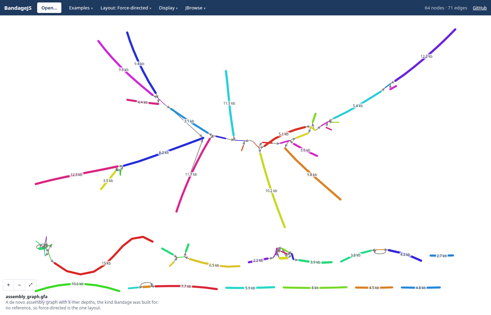
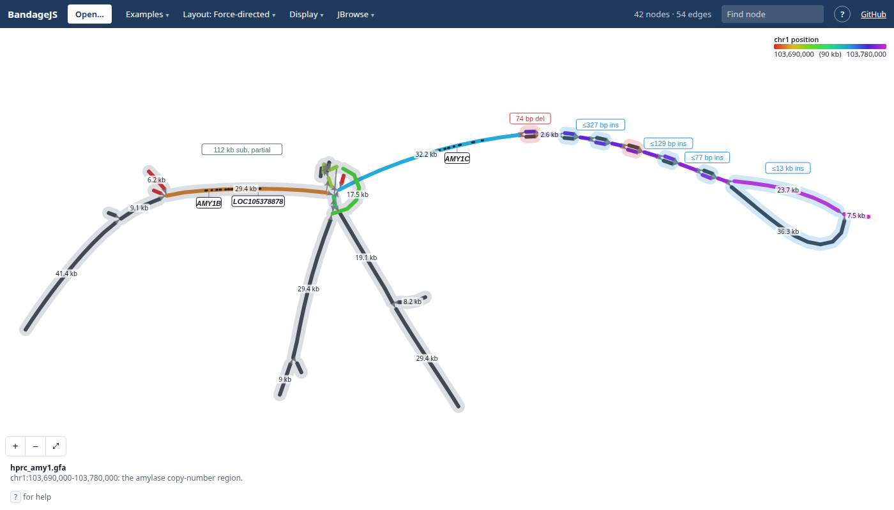
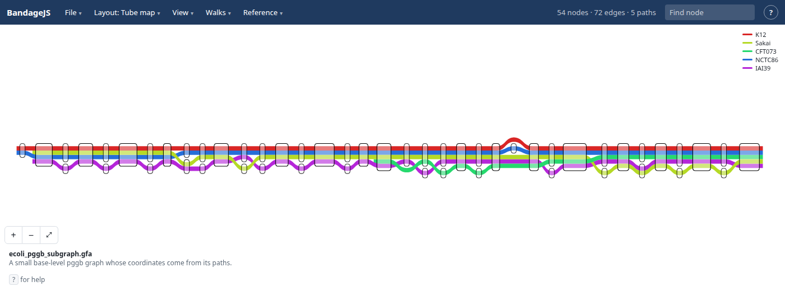

# BandageJS

View GFA graphs in the browser: https://jbrowse.org/demos/bandagejs/

- Bandage's FMMM layout, compiled to wasm and run in a worker
- Anchored, ordered, sample-row, walk-row and variant-map layouts for graphs
  with reference coordinates, and sequenceTubeMap's tube map for graphs with
  paths
- Bubbles labelled by kind, and haplotype walks you can lift out of the drawing
- RefSeq genes on a graph whose reference is GRCh38 by name (`GRCh38#0#chr6`):
  exons along the reference nodes and names pinned below them. Display → Open
  genes… shows your own GFF3 or BED on any reference
- Open a file, paste a url, drop a GFA (plain or gzipped), or use `?gfa=<url>`
- The Open dialog lists recent files, urls and cuts to reopen in a click
- Cut a region live from a gbz-base database, such as HPRC's:
  `?gbz=hprc&loc=chr6:160,614,798-160,647,758&haps=HG00097,HG00133`

A de novo assembly graph, coloured at random per contig as Bandage does:

The amylase copy-number region, AMY1, from the HPRC graph:

Five E. coli strains through a pggb graph, as a tube map:

Built on
[@jbrowse/bandage-core](https://www.npmjs.com/package/@jbrowse/bandage-core),
the core of
[jbrowse-plugin-graphgenomeviewer](https://github.com/GMOD/jbrowse-plugin-graphgenomeviewer).
See [docs/developing.md](docs/developing.md).

The earlier BandageNG fork is on the
[`bandage-layout-js`](https://github.com/cmdcolin/BandageJS/tree/bandage-layout-js)
branch.

## License

GPL-3.0-or-later, building on [BandageNG](https://github.com/asl/BandageNG) and
OGDF (https://www.ogdf.uni-osnabrueck.de/) which are both GPL license

## Footnote

This was first started at Cold Spring Harbor while I was TA'ing for Programming
for Biology in 2025
